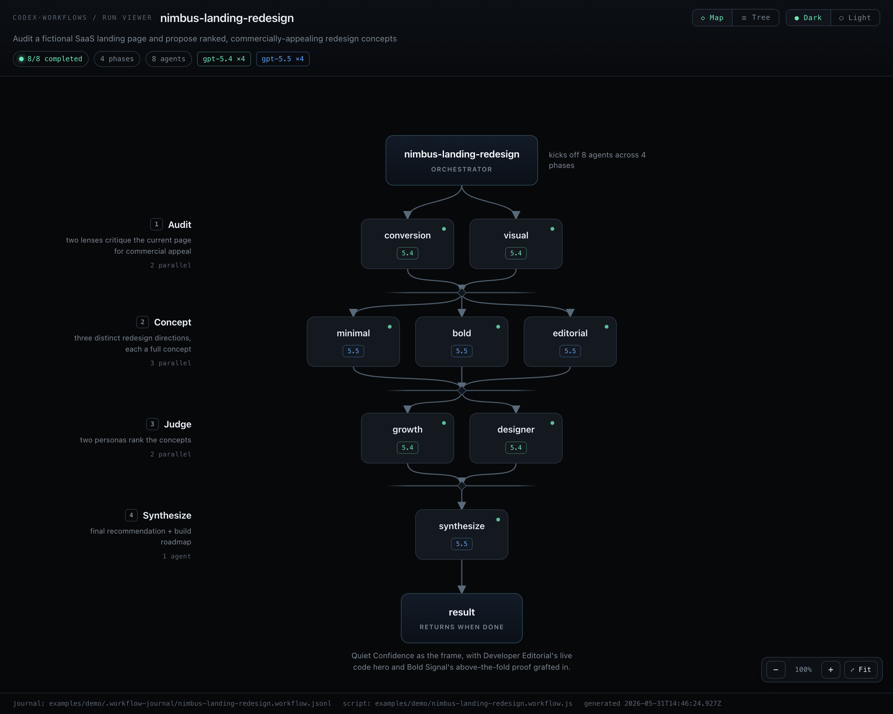
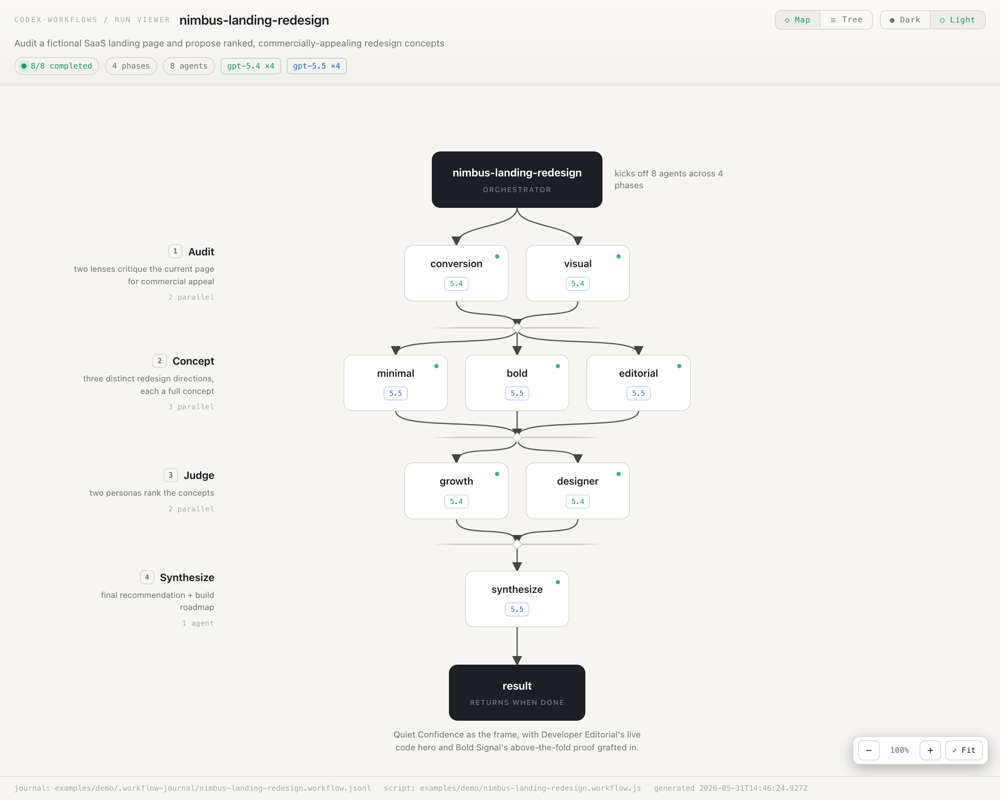
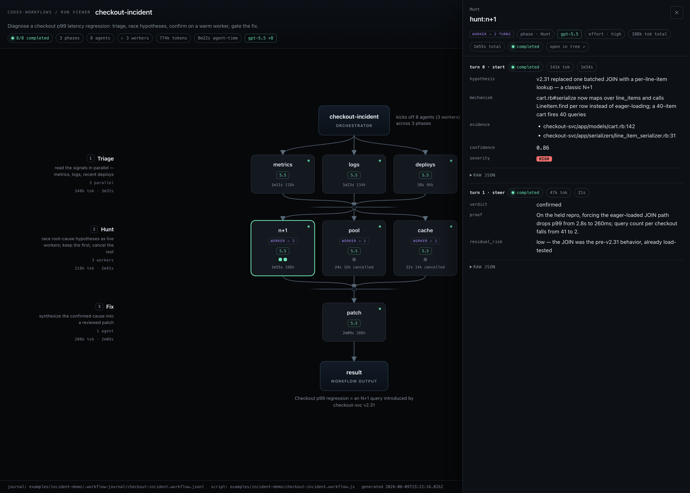
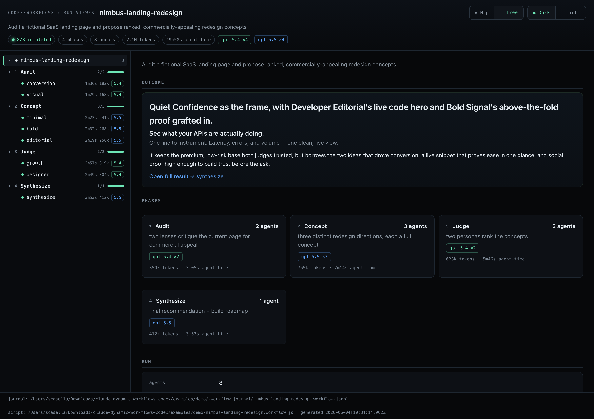

# Claude Dynamic Workflows — on Codex

> Run Claude Code's **dynamic-workflow orchestration** on a local **Codex (GPT)** backend — and **visualize any run** as an interactive execution map.

[](LICENSE)


[](https://github.com/scasella/claude-dynamic-workflows-codex/actions/workflows/ci.yml)



This repo is two things that fit together:

1. **A Claude Code skill + runner** that executes the dynamic-workflows DSL —
   `agent()` / `parallel()` / `pipeline()` / `phase()` / `budget` — against your
   local `codex app-server`. A fleet of **Codex/GPT agents** does the work instead
   of Claude subagents. You author the workflow exactly like a native one; only the
   agent backend changes.
2. **A run viewer** — a self-contained HTML **execution map** (orchestrator → phases
   → agents → result) with zoom/pan, light/dark themes, per-agent token/time metrics,
   and a per-agent detail inspector. It renders *any* run's structured results
   generically, works offline as a single file, and can **monitor a run live** — in
   the browser or as a terminal ASCII map — patching itself in place with no flicker.

> Unofficial / community project. Not affiliated with OpenAI or Anthropic.
> "Codex" and "Claude" are trademarks of their respective owners.

---

## See it now (no Codex required)

The viewer is offline and self-contained, and a sample run is bundled:

```bash
git clone https://github.com/scasella/claude-dynamic-workflows-codex
cd claude-dynamic-workflows-codex
node runner/bin/view-run.js examples/demo --open
```

That opens the map above — a fictional 4-phase landing-page review (Audit → Concept
→ Judge → Synthesize). Click any node to open its full result; press **F** to frame
the whole graph, drag to pan, scroll to zoom.

| Dark | Light |
| :--- | :--- |
|  |  |

Click a node → drill into its structured result (schema-aware: tables, color
swatches, score pills, severity/effort badges, raw JSON):



---

## Why

Claude Code has [dynamic workflows](https://code.claude.com/docs/en/workflows): a
JavaScript script orchestrates dozens-to-hundreds of subagents at scale, and the
runtime holds the loop, branching, and intermediate results so your context only
sees the final answer. It's great for codebase audits, large migrations, and
cross-checked research.

This project **re-hosts that same DSL but points `agent()` at Codex** — so you can
fan work across GPT-5 agents from the same script shape. It adds the piece the
native feature doesn't have for arbitrary backends: a standalone, shareable
**visualization** of what a run actually did.

---

## Install as a Claude Code skill

Clone the repo into your personal skills folder, as the `codex-workflows` skill:

```bash
git clone https://github.com/scasella/claude-dynamic-workflows-codex ~/.claude/skills/codex-workflows
```

**Prerequisites**

- [Node](https://nodejs.org) ≥ 18
- The [`codex`](https://developers.openai.com/codex/cli) CLI on your `PATH`, logged in:
  `codex login` (verify with `node ~/.claude/skills/codex-workflows/runner/test/handshake.js`)

Then, in Claude Code:

```
/codex-workflows  Audit every route under src/ for missing auth checks
```

The skill is **manual-invoke only** — Claude won't auto-trigger it. When you invoke
it, Claude authors a workflow script and runs it on Codex via the bundled runner,
pinning every agent to the latest frontier model.

> Don't use Claude Code? You can still use the **runner and viewer standalone** —
> see below.

---

## Use the runner standalone

```bash
# Author or reuse a workflow script (the DSL is documented in references/authoring.md),
# then run it against Codex — pinning all agents to the latest frontier model:
node runner/bin/run-workflow.js examples/demo/nimbus-landing-redesign.workflow.js --frontier

# Progress streams on stderr; the workflow's return value prints as JSON on stdout.
```

Useful flags: `--frontier` (pin all agents to the auto-detected latest frontier
model), `--auto-effort` (scale effort to layer width — lone judge/synthesize gates
think hardest), `--plan` (dry-run agent count + budget estimate, no tokens),
`--sandbox read-only|workspace-write`, `--budget N` (token ceiling) with
`--budget-meter total|output`, `--tui` / `--gui` / `--monitor` (watch the run live —
terminal map, browser viewer, or both), `--resume` (reuse a prior run's results from
the journal). See `runner/bin/run-workflow.js --help`.

A minimal script:

```js
export const meta = { name: "hello", description: "two agents in parallel", phases: [{ title: "Answer" }] };
phase("Answer");
const [a, b] = await parallel([
  () => agent("Reply with one word: pong."),
  () => agent("Capital of France?", { schema: { type: "object", required: ["capital"],
    additionalProperties: false, properties: { capital: { type: "string" } } } }),
]);
return { a, b };
```

---

## View a past run

Every run writes a journal to `<project>/.workflow-journal/<name>.jsonl`. Turn it
into a viewer:

```bash
node runner/bin/view-run.js <project-dir> --open
node runner/bin/view-run.js <project-dir> --watch --open   # live: updates in place as the run grows
# or point at a journal / script explicitly:
node runner/bin/view-run.js --journal path/to.jsonl --script path/to.workflow.js --out run.html
```

Prefer the terminal? Render the same run as an **ASCII execution map**, with a
live `--watch` that redraws in place as the run progresses:

```bash
node runner/bin/map-run.js <project-dir>           # one-shot ASCII map
node runner/bin/map-run.js <project-dir> --watch   # live: redraws as the journal grows
```

```text
╭─ ◆ market-news ──────────────────────────────────────────────────────────────╮
│ ✓✓✓✓✓✓  6/6 done · 2 phases · 701k tok · 20m27s · gpt-5.5                    │
╰──────────────────────────────────────────────────────────────────────────────╯
  │
  ▼ ① Gather ───────────────────────────────────  5 agents · 622k tok · 17m38s
      AGENT      MODEL    EFFORT  TOKENS    WALL
  ├─✓ indices    gpt-5.5  high       52k   1m26s
  │   S&P 500 rose 0.4% to a record 6,012; Nasdaq +0.6% and Dow +0.3% at the
  │   June 2 close.
  ├─✓ movers     gpt-5.5  high      140k   5m16s
  │   Nvidia gained ~3% on AI demand; a major retailer slid 8% after cutting
  │   guidance.
  ╰─✓ catalysts  gpt-5.5  high      128k   3m27s
      Several megacap earnings beat after the bell; Fed speakers stayed
      data-dependent.
  ┄ barrier · Gather → Synthesize ┄┄┄┄┄┄┄┄┄┄┄┄┄┄┄┄┄┄┄┄┄┄┄┄┄┄┄┄┄┄┄┄┄┄┄┄┄┄┄┄┄┄┄┄┄┄┄
  ▼ ② Synthesize ──────────────────────────────────  1 agent · 79k tok · 2m49s
  ╰─✓ brief      gpt-5.5  xhigh      79k   2m49s
      Fed, jobs and AI earnings kept stocks near records into June 3.
  │
  ▼
╭─ ✦ result ───────────────────────────────────────────────────────────────────╮
│ Fed, jobs and AI earnings kept stocks near records, but June 3 closing       │
│ levels were not yet final at midday.                                         │
╰──────────────────────────────────────────────────────────────────────────────╯
```

The viewer has two layouts (toggle top-right), a **Dark / Light** theme switch, and
works for any run shape. Every agent's **tokens, time, model, and effort** (recorded
by the runner) show at agent, phase, and run level.

- **◇ Map** — the execution map: orchestrator → one row of parallel agents per phase
  → barrier merges → **result**. Each agent node carries its model, time, and tokens;
  it opens at a readable 100%, centered — **Fit** (`F`) frames the whole graph, `0`
  resets to 100%, scroll zooms toward the cursor, drag pans. Wide fan-outs (more than
  ~12 agents in a phase) fold into an **aggregate node** (`+N more`, with the hidden
  agents' running count and token total) that you expand inline — running agents are
  never hidden. Click any node, or the **result** node, for a slide-in **inspector**
  that *docks beside* the graph (the map stays visible behind it) and shows the full
  structured result.
- **☰ Tree** — a dense `Run → Phase → Agent` inspector: each phase row shows a
  **progress bar** with `done/total`, each agent row shows its time, tokens, and
  model inline, and the run's actual **returned value** renders at the top — so you
  can read the whole run without opening a single node:



Both views render results generically (arrays-of-objects → tables with sticky
headers, `palette` → color swatches, `severity`/`effort` → badges, 1–10 scores →
pills, plus a raw-JSON toggle) and handle flat label-less runs, huge fan-outs,
journal-only runs (no model chips), and string/null results. The **result** node
shows the workflow's real return value when the runner captured it — not a heuristic
guess at a "final" agent.

The whole viewer is **keyboard-navigable** — Tab between nodes, Enter/Space to open
the inspector, arrows to expand/collapse phases, **Esc** to close — with visible
focus rings, and it respects `prefers-reduced-motion`.

### Live, in place — no reload

Add **`--watch`** and the viewer becomes a live monitor that updates **without ever
reloading the page**. As the run progresses it patches the DOM in place: running
agents appear amber with a **ticking elapsed clock** (and amber edges through the
phase that's still working), finished agents flip to their result, and a status
strip tracks **wall-clock, last-update age, and a running count**. Your view is never
yanked: the theme, the Map/Tree toggle, the open inspector, scroll position, and map
zoom/pan all survive every update — an inspector left open on a still-running agent
fills in *in place* the moment that agent's result lands. When the run finishes the
strip retires and the page settles into the static, shareable artifact.

It stays a **single self-contained file**: the live channel writes tiny sidecar files
next to the HTML and pulls them with a script tag (not `fetch`), so it updates live
even when opened straight from disk as a `file://` — no server, no network.

---

## Watch a run build live

One command fans out agents to gather **today's US stock-market news** and shows
the run building as a live ASCII map. Agents appear as **running** (spinner +
elapsed) the moment they start and flip to `✓` with their tokens/time when they
finish; the footer tracks wall-clock and a live done/running count. It exits on its
own when the run finishes (needs `codex login`; the agents use **live web access**,
and a web-research run takes a few minutes):

```bash
npm run demo:live
# or a different example / inputs:
node runner/bin/demo-live.js --script examples/triage.workflow.js --args '{"items":[{"id":"1","text":"crash on empty config"}]}'
```

Mid-run, completed agents show their finding (a 1–2 sentence snippet of what they
returned) while the rest are still in flight:

```text
╭─ ◆ market-news ──────────────────────────────────────────────────────────────╮
│ ✓✓⠋⠋⠋  2/5 done · 3 running · 1 phase · 218k tok · 4m53s · gpt-5.5           │
╰──────────────────────────────────────────────────────────────────────────────╯
  │
  ▼ ① Gather ──────────────────────────  2 done · 3 running · 218k tok · 4m53s
      AGENT      MODEL    EFFORT  TOKENS    WALL
  ├─✓ indices    gpt-5.5  high       52k   1m26s
  │   S&P 500 rose 0.4% to a record 6,012; Nasdaq +0.6% and Dow +0.3% at the
  │   June 2 close.
  ├─✓ sectors    gpt-5.5  high      166k   3m27s
  │   Technology and communication services led; energy and utilities lagged.
  ├─⠋ movers     gpt-5.5  high        --   6m00s
  ├─⠋ macro      gpt-5.5  high        --   6m00s
  ╰─⠋ catalysts  gpt-5.5  high        --   6m00s
  │
  ▼
╭─ ✦ result ───────────────────────────────────────────────────────────────────╮
│ in progress…                                                                 │
╰──────────────────────────────────────────────────────────────────────────────╯
```

As each agent finishes, its spinner flips to `✓` and its snippet appears; a barrier
holds, then a lone `synthesize` agent writes the cited brief that becomes the
result node.

Or just add **`--tui`** / **`--gui`** to any `run-workflow.js` invocation and it
auto-opens a live monitor that tracks the run as it goes — `--tui` opens the ASCII
map in a new terminal window, `--gui` opens the HTML viewer in your browser,
`--monitor` opens both. Each shows **every agent, running + done**, with constant
updates — the browser viewer patches in place (no flicker, no reload) and settles to
the finished run automatically when it's done:

```bash
node runner/bin/run-workflow.js examples/market-news.workflow.js --frontier --auto-effort --gui --tui \
  --args '{"date":"today"}'
```

To wire it up by hand against any run — run the workflow in one terminal and watch
in another, both pointed at the **same journal**:

```bash
# terminal A — run, writing a known journal path
node runner/bin/run-workflow.js examples/tournament-sort.workflow.js --frontier --auto-effort \
  --sandbox read-only --journal /tmp/run.jsonl \
  --args '{"criterion":"most likely to be a flaky test","bucketSize":3,"items":["test_login asserts on Date.now()","test_api retries 3x on 500","test_math pure arithmetic"]}'

# terminal B — live map (pre-create the journal so the watcher can attach first)
: > /tmp/run.jsonl
node runner/bin/map-run.js --journal /tmp/run.jsonl --watch
```

---

## How it works

Claude Code's workflow runtime is sealed inside its binary, so this is an **external
re-host** of the DSL. The only provider-specific piece is `agent()`:

| Workflow concept | Codex mapping |
| :--- | :--- |
| `agent(prompt)` → final text | `thread/start` + `turn/start`, last `agentMessage.text` |
| `agent(prompt, { schema })` | native `turn/start.outputSchema` → parsed JSON |
| `agentType: 'x'` | loads `.claude/agents/x.md` → `developerInstructions` |
| Claude model id / alias | remapped to an available Codex model via `model/list` |
| sandbox / permissions | `approvalPolicy:"never"` + sandbox |
| transient errors | retry with backoff; app-server auto-reconnect |
| `parallel` / `pipeline` / `phase` / `budget` | unchanged — provider-neutral JS |

Workflow scripts run in an isolated `node:vm` context (no `fs`/`process`/`fetch`;
non-deterministic builtins blocked) — the agents do the I/O, the script coordinates.
A resume journal caches each completed agent so reruns skip unchanged work.

Full internals, the protocol mapping, and a faithfulness comparison vs. the native
runtime are in [`references/runner-readme.md`](references/runner-readme.md). The
DSL + authoring patterns are in [`references/authoring.md`](references/authoring.md).

---

## Requirements & compatibility

- **Node ≥ 18**, zero npm dependencies.
- A logged-in **`codex` CLI** with the `app-server` subcommand. Built and verified
  against `codex` **0.135.0**; method names/shapes are stable, but you can regenerate
  bindings for your version with `codex app-server generate-json-schema --out DIR`.

## Safety

Workflow agents run with `approvalPolicy: "never"` inside a Codex sandbox (default
`sandbox: workspace-write`) — like any autonomous agent run, they read, write, and
execute shell commands **without prompting**. Run untrusted or exploratory tasks
with `--sandbox read-only`, and read a workflow script before you run it. The
workflow *script itself* is isolated (no filesystem/network/process access) — only
the agents act.

## Limitations (honest)

- This is a **standalone re-host**, not the in-Claude-Code experience: no in-session
  background tasks, no `/workflows` TUI, no save-as-`/command` — though `--watch`
  gives a live viewer and `workflow("name")` resolves saved workflows from
  `.claude/workflows/`.
- A couple of native nuances aren't replicated 1:1: **warm-context resume** (the
  journal replays *results*, not Codex thread state via `thread/fork`), and budget
  accounting is per-process (`--budget-meter` selects total vs the native
  output-token pool). The map models barrier/phase structure (a clean
  approximation for pipeline-shaped runs). Details in the internals doc.

## Development

```bash
npm test        # offline unit checks + viewer robustness across run shapes (no Codex, no network)
npm run doctor  # verify the local Codex App Server is reachable & logged in
npm run demo    # open the bundled sample run in the viewer
```

See [CONTRIBUTING.md](CONTRIBUTING.md).

## Repository layout

```
SKILL.md                  the Claude Code skill (manual-invoke /codex-workflows)
runner/                   standalone runner (Node, zero deps)
  bin/run-workflow.js     execute a workflow script on Codex
  bin/view-run.js         generate the HTML run viewer
  bin/map-run.js          render the run as an ASCII map in the terminal (--watch)
  bin/demo-live.js        run an example + watch it build live (npm run demo:live)
  src/                    codexAgent (the seam) + runtime, transport, helpers
  src/runModel.js         shared run-model assembly (HTML + ASCII viewers)
  src/asciiMap.js         ASCII map renderer
  test/                   offline + view-run + map-run robustness + handshake
references/               authoring.md (DSL) · runner-readme.md (internals)
examples/                 market-news · hello · review · bug-hunt · review-gates · tournament-sort · triage · classify-route · deep-research · demo/
docs/                     screenshots
```

## License

[MIT](LICENSE) © Stephen Casella.
